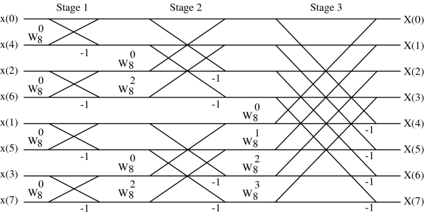
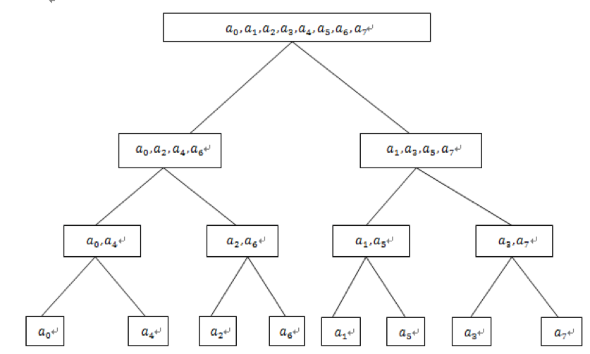

<!--more-->

$$
\begin{align*}
\newcommand{\dif}{\mathop{}\!\mathrm{d}}
\newcommand{\belowarrow}[1]{\mathop{#1}\limits_{\uparrow}}
\newcommand{\bd}{\boldsymbol}
\newcommand{\L}{\mathscr{L}}
\newcommand{\red}{\color{red}}
\newcommand{\xleftrightarrow}[1]{\stackrel{#1}{\longleftrightarrow}}
\end{align*}
$$

虽说 DFT 不需要像 DTFT 那样算无穷多项了，但要算的东西也是挺多的，我们来分析一下复杂度：

$$
X[k]=\sum_{n=0}^{N-1}x[n]W_N^{kn},\;k=0,1,\cdots,N-1\\
W_N^{kn}=e^{-2\pi kn/N}
$$

要计算出 $N$ 个 $X[k]$，必须进行 $N^2$ 次复数乘法和 $N(N-1)$ 次复数加法，时间复杂度为 $O(N^2)$。

假如有一个 44.1 kHz 采样率的 1s 音频，那么乘法的运算量大约是 1.94G，而现在的计算机处理速度也就 3~5GHz，也就是说 1s 也就算个几次 DFT，要是换以前的 CPU，估计得算一个星期😓。

但我们可以利用 DFT 中 $W_N^{kn}$ 的一些特殊性质来简化计算。比如说：$W_N^{k+\frac{N}{2}}=-W_N^k$，这样的话就可以减少一半的运算量，但时间复杂度还是 $O(N^2)$。如果用上其他性质，就能在 $O(n\log n)$ 时间内求出来，就得到我们的 FFT 算法。

# 基-2 FFT

## DIT-FFT 算法

按时间抽取 FFT 算法（DIT-FFT，Decimation In Time FFT），也叫 Cooley-Tukey Fast Fourier Transform，是 1965 年由 Cooley 和 Tukey 提出，现在使用的大部分 FFT 都是在这个算法的基础上进行改进的。这个算法的步骤如下：

设序列 $x[n]$ 的长度 $N$ 是 $2$ 的幂，我们将 $x[n]$ 分解为偶数点和奇数点：

$$
\begin{aligned}
  x_1 [r] &= x[2r]\\
  x_2 [r] &= x[2r+1]
\end{aligned}\; r=0,1,\cdots,\frac{N}{2}-1
$$

从而 $X[k]$ 可以分解为：

$$
\begin{aligned}
  X[k]&=\sum_{n = 偶} x[n] W_N^{kn}+\sum_{n = 奇} x[n] W_N^{kn}\\
  &=\sum_{r=0}^{N/2-1} x[2r] W_N^{2kr}+W_N^{k} \sum_{r=0}^{N/2-1} x[2r+1] W_N^{2kr}\\
  &=\sum_{r=0}^{N/2-1} x[2r] (W_N^{2})^{kr}+W_N^{k} \sum_{r=0}^{N/2-1} x[2r+1] (W_N^{2})^{kr}
\end{aligned}
$$

由于 $W_N^2=W_{N/2}$，所以（注意 $k$ 的取值范围）：

$$
\begin{aligned}
  X[k]&=\sum_{r=0}^{N/2-1} x[2r] W_{N/2}^{kr}+W_N^{k} \sum_{r=0}^{N/2-1} x[2r+1] W_{N/2}^{kr}\\
  &=X_1[k]+W_N^k X_2[k] \quad k=0,1,\cdots,N-1
\end{aligned}
$$

根据 $W_N^{k+\frac{N}{2}}=-W_N^k$，如果要算 $X[k+\frac{N}{2}]$，易得：

$$
X[k+\frac{N}{2}] = X_1[k]-W_N^k X_2[k] \quad k=0,1,\cdots,N-1
$$

总的来说，这是一次蝶形运算，运算量是 1 乘 2 加。

<!--  -->

利用这个思想，我们可以进行递归：

$$
\log_2 N
\begin{cases}
\quad\quad\quad\quad N\\
\quad\quad\quad\swarrow \quad\searrow\\
\quad\quad N/2 \quad\; N/2\\
\quad\;\swarrow \quad\searrow \;\; \swarrow \quad\searrow\\
N/4 \;\; N/4 \; N/4 \;\; N/4\\
\quad\quad\quad\quad\;\vdots\\
\end{cases}
$$

每级的蝶形运算有 $N/2$ 个，每个蝶形运算包括一个复数乘法和两个加法，一共有 $\log_2 N$ 级，所以复杂度为 $O(N\log N)$

以 $N=8$ 为例：

<!--  -->

|计算流图|树形图|
|-------|-----|
|||

我们来看看一个比较有趣的东西。将树形图中的编号写成二进制的形式：

<table>
<tr>
  <td style="text-align:center" colspan="1">$X_0=00\red0$</td>
  <td style="text-align:center" colspan="1">$X_1=00\red1$</td>
  <td style="text-align:center" colspan="1">$X_2=01\red0$</td>
  <td style="text-align:center" colspan="1">$X_3=01\red1$</td>
  <td style="text-align:center" colspan="1">$X_4=10\red0$</td>
  <td style="text-align:center" colspan="1">$X_5=10\red1$</td>
  <td style="text-align:center" colspan="1">$X_6=11\red0$</td>
  <td style="text-align:center" colspan="1">$X_7=11\red1$</td>
</tr>
<tr>
  <td style="text-align:center" colspan="4">$00\red0$ $01\red0$ $10\red0$ $11\red0$</td>
  <td style="text-align:center" colspan="4">$00\red1$ $01\red1$ $10\red1$ $11\red1$</td>
</tr>
<tr>
  <td style="text-align:center" colspan="2">$0\red00$ $1\red00$</td>
  <td style="text-align:center" colspan="2">$0\red10$ $1\red10$</td>
  <td style="text-align:center" colspan="2">$0\red01$ $1\red01$</td>
  <td style="text-align:center" colspan="2">$0\red11$ $1\red11$</td>
</tr>
<tr>
  <td style="text-align:center" colspan="1">$x_0=\red000$</td>
  <td style="text-align:center" colspan="1">$x_4=\red100$</td>
  <td style="text-align:center" colspan="1">$x_2=\red010$</td>
  <td style="text-align:center" colspan="1">$x_6=\red110$</td>
  <td style="text-align:center" colspan="1">$x_1=\red001$</td>
  <td style="text-align:center" colspan="1">$x_5=\red101$</td>
  <td style="text-align:center" colspan="1">$x_3=\red011$</td>
  <td style="text-align:center" colspan="1">$x_7=\red111$</td>
</tr>
</table>

注意到，从上往下先是按二进制的第1位分奇偶，然后再按第2位、第三位……，最终，使得最下面与最上面的二进制恰好“对称”，这称为 **比特逆序**。

如果我们定义第 $r$ 级蝶形运算的输入是 $\Psi_r[\alpha]$ 和 $\Psi_r[\beta]$，并且特殊的，对于第一级，$\Psi_r[k]$ 对应的是比特逆序的 $k$，对于最后一级则是正常的 $k$。则每个蝶形运算可以表示为：

$$
\displaylines{
\Psi_{r+1}[\alpha] = \Psi_r[\alpha]+W_N^\ell \Psi_r[\beta]\\
\Psi_{r+1}[\beta] = \Psi_r[\alpha]-W_N^\ell \Psi_r[\beta]
}
$$

$\alpha$，$\beta$，$r$，$\ell$ 之间满足一些关系：

1. $\alpha=a\cdot 2^r+b$，其中，$a=0,1,\cdots,N/2^r-1$，而 $b=0,1,\cdots,2^{r-1}-1$
2. $\beta$ 与 $\alpha$ 一一对应，$\beta=\alpha+2^{r-1}$
3. $\ell=b\cdot N/2^r$

我推导上面的式子只是为了好玩而已，课本中有库利-图基FFT算法的一般形式。考试中最好还是列计算流图。

## DIF-FFT

按频率抽取（Decimation In Frequency）FFT 算法可以简单理解为 DIT-FFT 的翻转版。我们不将 $x[n]$ 进行奇偶分解，而是对 $X[k]$ 进行奇偶分解：

$$
\begin{aligned}
X[2r]&=\sum_{n=0}^{N-1} x[n] W_N^{n(2r)}\\
&=\sum_{n=0}^{N/2-1} x[n] W_N^{n(2r)}+\sum_{n=N/2}^{N-1} x[n] W_N^{n(2r)}\\
&=\sum_{n=0}^{N/2-1} x[n] W_N^{n(2r)}+W_N^{Nr}\sum_{n=0}^{N/2-1} x[n+N/2] W_N^{n(2r)}\\
&=\sum_{n=0}^{N/2-1} (x[n]+x[n+N/2]) W_{N/2}^{nr}\,,r=0,1,\cdots,N/2-1
\end{aligned}
$$

$$
\begin{aligned}
X[2r+1]&=\sum_{n=0}^{N-1} x[n] W_N^{n(2r+1)}\\
&=\sum_{n=0}^{N/2-1} x[n] W_N^{n(2r+1)}+\sum_{n=N/2}^{N-1} x[n] W_N^{n(2r+1)}\\
&=\sum_{n=0}^{N/2-1} x[n] W_N^{n(2r+1)}+W_N^{(Nr+N/2)}\sum_{n=0}^{N/2-1} x[n+N/2] W_N^{n(2r+1)}\\
&=\sum_{n=0}^{N/2-1} (x[n]-x[n+N/2]) W_N^r W_{N/2}^{nr}\,,r=0,1,\cdots,N/2-1
\end{aligned}
$$

DIF-FFT 与 DIT-FFT 蝶形运算的对比如下：

8 点 FFT 的计算流图如下：

<!--  -->

注意到 $x[n]$ 是比特顺序，$X[k]$ 是比特逆序，这恰好与 DIT-FFT 相反。 

# 算法实现

[FFTW](http://www.fftw.org/) 是一个用于计算 DFT 的 C 语言库，它是开源的~

# 参考

* 课本：数字信号处理——基于计算机的方法（第四版）
* [从多项式乘法到快速傅里叶变换](http://blog.miskcoo.com/2015/04/polynomial-multiplication-and-fast-fourier-transform)
* [快速傅立叶变换(FFT)](https://yangyh408.github.io/2019/04/08/%E5%BF%AB%E9%80%9F%E5%82%85%E7%AB%8B%E5%8F%B6%E5%8F%98%E6%8D%A2-FFT/)